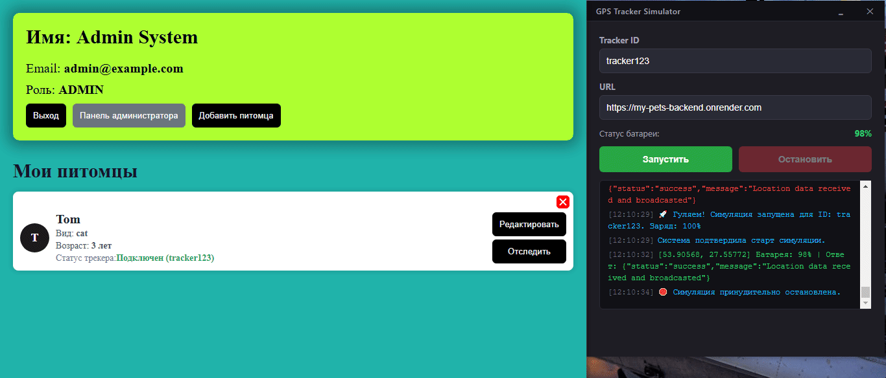

# 🐾 MyPets Full-Stack Platform

Комплексная Full-Stack платформа для учета домашних животных, администрирования пользователей и высоконагруженного real-time трекинга питомцев.

Проект построен на базе микросервисной архитектуры, объединяющей клиентское SPA-приложение, производительное API, реляционную СУБД, in-memory кэш и обратный прокси-сервер Nginx для оркестрации трафика.

---

## 🛠 Технологический Стек

### Фронтенд (Папка `/frontend`)

- **Архитектура:** Feature-Sliced Design (FSD)
- **Базис:** React 18+, TypeScript, Vite
- **Стейт-менеджмент & API:** Axios (с реактивным интерцептором автоматического обновления сессий и очередью запросов), Socket.io-client
- **Тестирование:** Vitest, React Testing Library (RTL)

### Бэкенд (Папка `/backend`)

- **Платформа:** Node.js (Express.js, ES6+ Modules)
- **Базы данных & Кэш:** PostgreSQL 16, Redis 7 (In-memory хранилище)
- **ORM:** Prisma ORM (с кастомным путем генерации клиента внутри `src/generated/prisma`)
- **Real-time транспорт:** Socket.io (WebSockets с авторизацией нативного парсинга кук при handshake)
- **Планировщик:** Node-cron (автоматизация фоновых задач)
- **Документация:** Swagger UI (OpenAPI v3, YAML)
- **Безопасность:** JWT (Access/Refresh токенизация), Cookie-parser, Ролевая модель доступа (RBAC), Zod-валидация входящих схем данных

### Инфраструктура

- **Прокси:** Nginx (Reverse Proxy, разграничение путей и сокетов, склеивание Origin)
- **Контейнеризация:** Docker, Docker Compose (Multi-stage сборки статики)

---

## 🏗 Архитектурные Особенности

### 1. Бесшовная Авторизация без CORS и XSS

Система авторизации использует связку короткоживущих `accessToken` и долгоживущих `refreshToken`.

- **Безопасность:** Токены полностью изолированы от клиентского JavaScript. Они не передаются в теле JSON-ответов и не сохраняются в LocalStorage, а записываются сервером в защищенные куки с флагами `httpOnly` и `SameSite=Lax`, что исключает возможность их кражи через XSS-атаки.
- **Реактивный Интерцептор:** Фронтенд-клиент оснащен умным перехватчиком Axios. Если `accessToken` истек, интерцептор ставит текущие параллельные запросы в очередь (`failedRequestsQueue`), выполняет скрытый `POST /auth/refresh`, а затем автоматически повторяет все упавшие запросы в строгом хронологическом порядке.
- **Динамический CORS:** Использование httpOnly-кук исключает заголовок `*`. В проекте настроен динамический CORS-мидлвар, который считывает белый список доменов из конфигурации, сопоставляет их с заголовком Origin входящего запроса и сохраняет флаг `credentials` в значении `true`.

### 2. Оптимизация GPS-Трекинга (Redis -> PostgreSQL)

При интервале сигналов от GPS-трекера раз в 3 секунды, одно устройство генерирует до 1200 точек в час, что способно перегрузить I/O операции PostgreSQL. Для решения этой проблемы внедрена гибридная схема:

1. **Real-time поток:** Координаты от трекера поступают на эндпоинт, мгновенно сохраняются в оперативной памяти **Redis** с TTL 24 часа (`EX 86400`) и транслируются в сокет-комнату питомца `pet:${petId}` для плавной отрисовки движения на фронтенде без задержек.
2. **Батч-фильтрация (Каждые 5 минут):** Сервер проверяет по временному маркеру в Redis, сколько времени прошло с момента последней записи в реляционную БД. В PostgreSQL сохраняется строго **одна контрольная точка раз в 5 минут**, снижая нагрузку на СУБД в 100 раз.
3. **Скользящее окно истории:** Каждые 60 минут планировщик `node-cron` автоматически очищает из таблицы `location_logs` записи старше 24 часов. База данных защищена от разрастания, а владелец всегда имеет быстрый доступ к истории перемещений за последние сутки.

### 3. Ролевая модель доступа (RBAC)

Права доступа разграничиваются на уровне маршрутов с помощью связки мидлваров `protect` и `restrictTo`:

- **USER:** Имеет доступ к управлению собственным профилем, списком своих питомцев и истории их перемещений.
- **ADMIN:** Обладает полными правами управления всей системой через изолированные маршруты `/admin/*` и имеет доступ к гео-трекам любых питомцев.

---

## ⚙️ Порядок Локального Запуска (3 режима)

Для запуска всей инфраструктуры необходимы установленные Docker и Docker Compose. Создайте файл `.env` в корне проекта и заполните его по следующему шаблону:

```env
# --- НАСТРОЙКИ БАЗЫ ДАННЫХ ---
DB_USER=mypets_admin
DB_PASSWORD=secure_db_password_2026
DB_NAME=mypets_db
DB_PORT=5432

# --- НАСТРОЙКИ REDIS ---
REDIS_HOST=redis
REDIS_PORT=6379

# --- НАСТРОЙКИ API ---
PORT=3001
API_PORT=3001

# --- ДИНАМИЧЕСКИЙ CORS (Адреса через запятую, без пробелов) ---
ALLOWED_ORIGINS=http://localhost:5173,http://localhost:8080,http://127.0.0.1:5500,http://localhost

# --- СЕКРЕТНЫЕ КЛЮЧИ ---
JWT_ACCESS_SECRET=super_secret_access_key_9876
JWT_REFRESH_SECRET=super_secret_refresh_key_5432

# --- СОЗДАНИЕ ДЕФОЛТНОГО АДМИНИСТРАТОРА ---
ADMIN_EMAIL=admin@example.com
ADMIN_PASSWORD=SuperSecretPassword123
```

Выберите один из трех режимов запуска под вашу текущую задачу:

### Вариант А: Режим Активной Разработки (Dev-гибрид)

_Базы данных и бэкенд изолированы в Docker, а фронтенд запускается локально на хост-машине. Обеспечивает моментальную перезагрузку интерфейса (HMR Vite) и удобную отладку._

1. Запустите инфраструктуру бэкенда и БД (терминал 1):
    ```bash
    docker-compose -f docker-compose.dev.yml up --build
    ```
2. Запустите фронтенд локально (терминал 2):
    ```bash
    cd frontend
    npm run dev
    ```
    _Интерфейс откроется на `http://localhost:5173`. Фронтенд автоматически свяжется с бэкендом._

### Вариант Б: Режим API-Only (Только Бэкенд)

_Запускаются базы данных и само API. Фронтенд полностью игнорируется. Идеально для тестирования эндпоинтов через Postman/Swagger или интеграции трекеров._

1. Запустите бэкенд без фронтенд-сервисов:
    ```bash
    docker-compose up --build
    ```
    _Бэкенд доступен напрямую по адресу `http://localhost:3001/api/v1`._

### Вариант В: Режим Full-Stack (Production-Like через Nginx)

_Все сервисы упаковываются в контейнеры, статика компилируется, а наружу открывается **только порт 80**. Используется для финальной проверки перед пушем в продакшен._

1. Запустите полную сборку с активацией профиля `fullstack`:
    ```bash
    docker-compose --profile fullstack up --build
    ```
2. Откройте в браузере: `http://localhost`

### Полезные диагностические команды:

- Проверить статус запущенных контейнеров: `docker compose ps`
- Посмотреть логи бэкенда в реальном времени: `docker compose logs -f api`

---

## 📡 Полная Карта API Эндпоинтов

Глобальный префикс всех HTTP-маршрутов: `/api/v1`

### 1. Модуль Аутентификации и Личного кабинета (`/auth`)

- `POST /auth/register` — Регистрация нового аккаунта (валидация по схеме `registerSchema`).
- `POST /auth/login` — Авторизация пользователя с последующей выдачей httpOnly кук токенов сессии.
- `POST /auth/refresh` — Обновление пары токенов (Access/Refresh) для продления активной сессии.
- `POST /auth/logout` — Инвалидация текущей сессии на сервере и полная очистка кук в браузере.
- `GET /auth/me` — Получение подробной информации о профиле текущего авторизованного пользователя (требуется валидный `accessToken`).

### 2. Модуль Питомцев текущего пользователя (`/pets`)

_Все маршруты этой группы требуют обязательной авторизации (мидлвар `protect`) и позволяют управлять только своими животными._

- `GET /pets` — Получение списка всех питомцев текущего пользователя (поддерживает пагинацию через `paginationQuerySchema`).
- `POST /pets` — Добавление нового питомца в личный кабинет (валидация по схеме `createPetSchema`).
- `GET /pets/:petId` — Получение детальной карточки конкретного питомца по его ID.
- `PATCH /pets/:petId` — Частичное обновление данных питомца (валидация по схеме `updatePetSchema`).
- `DELETE /pets/:petId` — Удаление карточки питомца из системы.

### 3. Модуль Геолокации и Трекинга (`/locations`)

- `POST /locations/tracker-data` — **Публичный технический эндпоинт трекера**. Принимает данные от GPS-модуля раз в 3 секунды (`trackerId`, `latitude`, `longitude`). Проходит Zod-валидацию по схеме `trackerPayloadSchema`. Записывает real-time данные в Redis и сбрасывает срез в Postgres раз в 5 минут.
- `GET /locations/pets/:petId/history` — **Получение суточного трека перемещений**. Маршрут защищен мидлварой `protect`. Доступ разрешен только владельцу питомца или пользователям с ролью `ADMIN`. Возвращает склеенный хронологический массив точек из Postgres за последние 24 часа и самую свежую позицию из Redis.

### 4. Модуль Администрирования (`/admin`)

_Все маршруты требуют успешной авторизации и наличия системной роли ADMIN (мидлвары `protect` и `restrictTo("ADMIN")`)._

#### Управление пользователями системы:

- `GET /admin/users` — Просмотр списка всех зарегистрированных пользователей платформы (с пагинацией).
- `POST /admin/users` — Создание нового пользователя администратором вручную (валидация по схеме `createUserSchema`).
- `GET /admin/users/:id` — Получение полной информации о любом пользователе по его ID.
- `PATCH /admin/users/:id` — Изменение данных пользователя администратором (валидация по схеме `updateUserSchema`).
- `DELETE /admin/users/:id` — Полное удаление пользователя и связанных с ним записей из системы.

#### Административное управление питомцами конкретного пользователя:

- `GET /admin/users/:userId/pets` — Посмотреть список питомцев любого конкретного пользователя по его `userId`.
- `POST /admin/users/:userId/pets` — Принудительное добавление питомца в профиль выбранного пользователя.
- `GET /admin/users/:userId/pets/:petId` — Получить карточку конкретного животного в профиле пользователя.
- `PATCH /admin/users/:userId/pets/:petId` — Отредактировать карточку питомца у любого пользователя.
- `DELETE /admin/users/:userId/pets/:petId` — Принудительно удалить питомца из профиля пользователя.

#### Безопасность и блокировки:

- `POST /admin/users/:userId/revoke-tokens` — Отзыв всех активных сессий (Refresh-токенов) выбранного пользователя, мгновенное разлогинивание со всех устройств и принудительный бан.

### 5. Техническая документация (OpenAPI / Swagger)

- `GET /api-docs` — Интерактивная документация всего API (Swagger UI). Позволяет просматривать схемы Zod-валидации, тестировать эндпоинты в реальном времени и сверять структуру ответов сервера.

## Скачать десктопное приложение

[Скачать трекер для Windows/macOS](https://github.com/yanyolkin/my-pets-tracker/releases/download/1.0.0/GPSTrackerSimulator.exe)

## Демонстрация работы

<p align="center">
  
</p>

